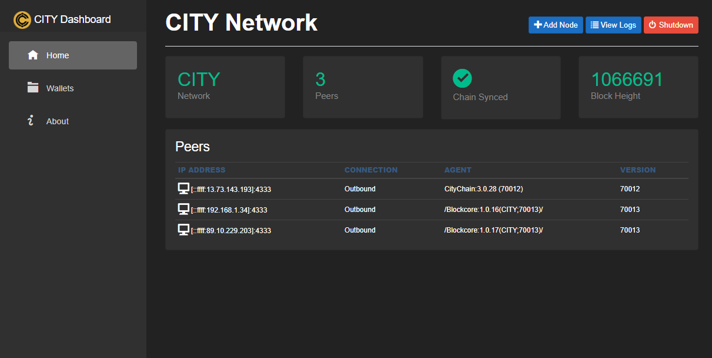
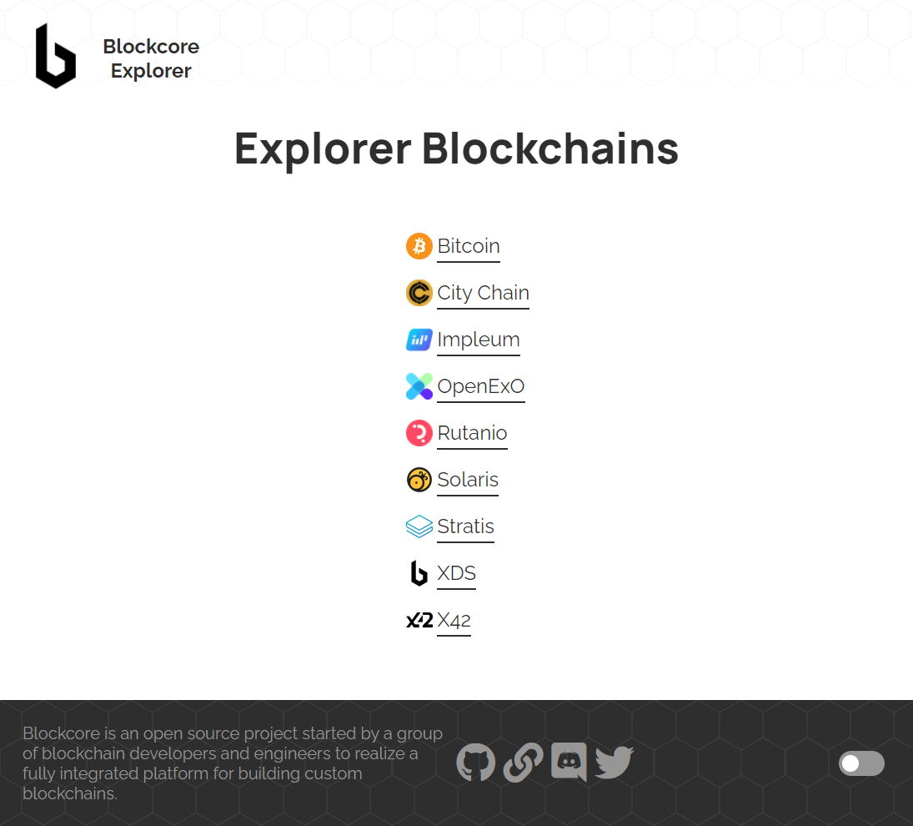

# Overview

## Node

The node software is a full node software that runs the blockchain network. It is compatible with Bitcoin and utilized by other blockchains at the primary full node.

To build your own blockchain based on Blockcore you have two options; perform a fork of our primary source code, this is preferred if you need to radically modify the blockchain functionality.

The other way is to utilize our blockchain template, which is generated and relies on published on NuGet. This enables you to quickly and easily launch your own blockchain, and you will easily be able to get latest updates without messing with source code.

To simplify using our tools, we have made instructions and generators available here.

Source repo for template-based node: https://github.com/block-core/blockcore-node (Preferred)

Source repo for fork-based node: 

[GitHub :fontawesome-brands-github:](https://github.com/block-core/blockcore){ .md-button .md-button--primary }

## Extension

The Blockcore Extension is an Non-Custodial HD wallet in your browser for Coins, Tokens, Identities, NFTs and more.

Extension keeps your identities and keys safe, while allowing you to communicate securely and authenticate with web apps (Web3 provider).

[GitHub :fontawesome-brands-github:](https://github.com/block-core/blockcore-extension){ .md-button .md-button--primary }

## Explorer

Together with the Blockcore Indexer (below), we have made the Blockcore Explorer. If you have a normal Blockcore based blockchain, it is super easy to add support for your custom chain and deploy your blockchain explorer.

The explorer has sections for Network and Insight, which shows statistics on the network and supply (total supply, circulating supply, rewards) and economy information on the blockchain.

[GitHub :fontawesome-brands-github:](https://github.com/block-core/blockcore-explorer){ .md-button .md-button--primary }

## Indexer

Being able to look up blocks, transactions and addresses is an important part of any blockchain. It is very easy to add your own custom blockchain to the explorer.

[GitHub :fontawesome-brands-github:](https://github.com/block-core/blockcore-indexer){ .md-button .md-button--primary }

## Tipbot

Blockcore Tipbot is a generic tipping bot for Discord (future support for Twitch and Twitter is being added) that supports all Blockcore blockchains. It is easy to configure and use, and allows communities to easily tip based on community work and contributions.

[GitHub :fontawesome-brands-github:](https://github.com/block-core/blockcore-tipbot){ .md-button .md-button--primary }

## Decentralized Identifiers

Blockcore is committed to supporting the ecosystem of Decentralized Identifiers (DIDs) and the DID method for Blockcore is "did:is:". This is a work in progress.

Specification: 
[GitHub :fontawesome-brands-github:](https://github.com/block-core/blockcore-did-method){ .md-button .md-button--primary }
