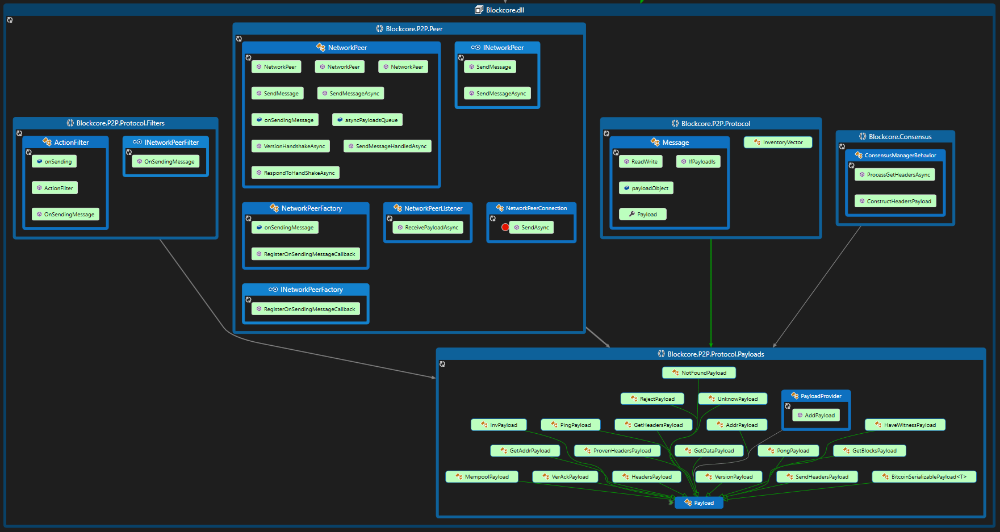

# Payloads

## Standard payloads

Built into the Blockcore foundation there are some payloads used to handle the peer to peer protocol and connections of nodes, and exchange of blockchain data.

Here are the built in primary payload types with their command names in parentheses:

- AddrPayload ("addr")
- BlockPayload ("block")
- GetAddrPayload ("getaddr")
- GetBlocksPayload ("getblocks")
- GetDataPayload ("getdata")
- GetHeadersPayload ("getheaders")
- GetProvenHeadersPayload ("getprovhdr")
- HaveWitnessPayload ("havewitness")
- HeadersPayload ("headers")
- InvPayload ("inv")
- MempoolPayload ("mempool")
- NotFoundPayload
- PingPayload ("ping")
- PongPayload ("pong")
- ProvenHeadersPayload ("provhdr")
- RejectPayload ("reject")
- SendHeadersPayload ("sendheaders")
- TxPayload ("tx")
- UnknowPayload
- VerAckPayload ("verack")
- VersionPayload ("version")

Here are payload types defined in features:

- FeeFilterPayload ("feefilter")
- PoAHeaderPayload ("poahdr")
- StoragePayload ("storage")
- StorageInvPayload ("storageinv")

Here is a code map of the payload in the Blockcore assembly:



Here is a code map of the custom payload types defined in features:


## Your own custom payload

You can implement your own custom payloads, which is a great way to build a communication solution between nodes connected in a peer to peer fashion.

You can use these custom features to build chat solutions, data transfer solutions or any other logic that can be useful for a network of nodes.

All you need is one or multiple payload types and an behavior class.

Example of a payload. You should define these classes inside your own custom feature.

```C#
// This sample is copied from the "ping" payload.
using NBitcoin;

namespace Blockcore.P2P.Protocol.Payloads
{
    [Payload("storage")]
    public class StoragePayload : Payload
    {
        private uint[] items;

        public uint[] Items { get { return this.items; } set { this.items = value; } }

        public StoragePayload(uint[] items)
        {
            this.items = items;
        }

        public override void ReadWriteCore(BitcoinStream stream)
        {
            stream.ReadWrite(ref this.items);
        }

        public override string ToString()
        {
            return base.ToString() + " : " + this.Items;
        }
    }
}
```

Then you also need a behavior that will process messages.

```C#
using System;
using System.Collections.Generic;
using System.Linq;
using System.Threading.Tasks;
using Blockcore.Connection;
using Blockcore.Interfaces;
using Blockcore.P2P.Peer;
using Blockcore.P2P.Protocol;
using Blockcore.P2P.Protocol.Behaviors;
using Blockcore.P2P.Protocol.Payloads;
using Blockcore.Signals;
using Blockcore.Utilities;
using Microsoft.Extensions.Logging;
using NBitcoin;

namespace Blockcore.Features.Storage
{
    /// <summary>
    /// Peer behavior for memory pool.
    /// Provides message handling of notifications from attached peer.
    /// </summary>
    public class StorageBehavior : NetworkPeerBehavior
    {
        /// <summary>Connection manager for managing peer connections.</summary>
        private readonly IConnectionManager connectionManager;

        /// <summary>Provider of IBD state.</summary>
        private readonly IInitialBlockDownloadState initialBlockDownloadState;

        /// <summary>Instance logger for the memory pool behavior component.</summary>
        private readonly ILogger logger;

        /// <summary>Factory used to create the logger for this component.</summary>
        private readonly ILoggerFactory loggerFactory;

        /// <summary>The network that this component is running on.</summary>
        private readonly Network network;

        /// <summary>
        /// Locking object for memory pool behaviour.
        /// </summary>
        private readonly object lockObject;

        /// <summary>
        /// The min fee the peer asks to relay transactions.
        /// </summary>
        public Money MinFeeFilter { get; set; }

        public StorageBehavior(
            IConnectionManager connectionManager,
            IInitialBlockDownloadState initialBlockDownloadState,
            ILoggerFactory loggerFactory,
            Network network)
        {
            this.connectionManager = connectionManager;
            this.initialBlockDownloadState = initialBlockDownloadState;
            this.logger = loggerFactory.CreateLogger(this.GetType().FullName);
            this.loggerFactory = loggerFactory;
            this.network = network;
            this.lockObject = new object();
        }

        /// <inheritdoc />
        protected override void AttachCore()
        {
            this.AttachedPeer.MessageReceived.Register(this.OnMessageReceivedAsync);
        }

        /// <inheritdoc />
        protected override void DetachCore()
        {
            this.AttachedPeer.MessageReceived.Unregister(this.OnMessageReceivedAsync);
        }

        /// <inheritdoc />
        public override object Clone()
        {
            return new StorageBehavior(this.connectionManager, this.initialBlockDownloadState, this.loggerFactory, this.network);
        }

        private async Task OnMessageReceivedAsync(INetworkPeer peer, IncomingMessage message)
        {
            try
            {
                await this.ProcessMessageAsync(peer, message).ConfigureAwait(false);
            }
            catch (OperationCanceledException)
            {
                this.logger.LogTrace("(-)[CANCELED_EXCEPTION]");
                return;
            }
            catch (Exception ex)
            {
                this.logger.LogError("Exception occurred: {0}", ex.ToString());
                throw;
            }
        }

        private async Task ProcessMessageAsync(INetworkPeer peer, IncomingMessage message)
        {
            try
            {
                switch (message.Message.Payload)
                {
                    case StoragePayload storagePayload:
                        await this.ProcessStorageInPayloadAsync(peer, storagePayload).ConfigureAwait(false);
                        break;
                }
            }
            catch (OperationCanceledException)
            {
                this.logger.LogTrace("(-)[CANCELED_EXCEPTION]");
                return;
            }
        }

        private async Task ProcessStorageInPayloadAsync(INetworkPeer peer, StoragePayload message)
        {
            Guard.NotNull(peer, nameof(peer));

            if (peer != this.AttachedPeer)
            {
                this.logger.LogDebug("Attached peer '{0}' does not match the originating peer '{1}'.", this.AttachedPeer?.RemoteSocketEndpoint, peer.RemoteSocketEndpoint);
                this.logger.LogTrace("(-)[PEER_MISMATCH]");
                return;
            }

            List<uint> list = new List<uint>();
            list.Add(1);
            list.Add(2);
            list.Add(3);

            await this.SendStorageAsync(peer, list);
        }

        private async Task SendStorageAsync(INetworkPeer peer, List<uint> storageList)
        {
            var queue = new Queue<uint>(storageList);

            while (queue.Count > 0)
            {
                uint[] items = queue.TakeAndRemove(5).ToArray();

                if (peer.IsConnected)
                {
                    this.logger.LogDebug("Sending items to peer '{0}'.", peer.RemoteSocketEndpoint);
                    await peer.SendMessageAsync(new StoragePayload(items)).ConfigureAwait(false);
                }
            }
        }

        public async Task SendTrickleAsync()
        {
            INetworkPeer peer = this.AttachedPeer;
            if (peer == null)
            {
                this.logger.LogTrace("(-)[NO_PEER]");
                return;
            }

            this.logger.LogDebug("Sending storage inventory to peer '{0}'.", peer.RemoteSocketEndpoint);
            try
            {
                // Sample data to send.
                List<uint> list = new List<uint>();
                list.Add(1);
                list.Add(2);

                await this.SendStorageAsync(peer, list).ConfigureAwait(false);
            }
            catch (OperationCanceledException)
            {
                this.logger.LogTrace("(-)[CANCELED_EXCEPTION]");
                return;
            }
        }
    }
}

```

Then finally you need your custom feature:

```C#
using System.Collections.Generic;
using System.Linq;
using System.Threading.Tasks;
using Blockcore.AsyncWork;
using Blockcore.Builder;
using Blockcore.Builder.Feature;
using Blockcore.Configuration.Logging;
using Blockcore.Connection;
using Blockcore.Features.Storage.Persistence;
using Blockcore.P2P.Peer;
using Blockcore.P2P.Protocol.Payloads;
using Blockcore.Utilities;
using Microsoft.Extensions.DependencyInjection;

namespace Blockcore.Features.Storage
{
    public class StorageFeature : FullNodeFeature
    {
        /// <summary>The async loop we need to wait upon before we can shut down this manager.</summary>
        private IAsyncLoop asyncLoop;

        /// <summary>Factory for creating background async loop tasks.</summary>
        private readonly IAsyncProvider asyncProvider;

        /// <summary>
        /// Connection manager injected dependency.
        /// </summary>
        private readonly IConnectionManager connection;

        /// <summary>Global application life cycle control - triggers when application shuts down.</summary>
        private readonly INodeLifetime nodeLifetime;

        private readonly PayloadProvider payloadProvider;

        private readonly StorageBehavior storageBehavior;

        public StorageFeature(
            IConnectionManager connection,
            INodeLifetime nodeLifetime,
            IAsyncProvider asyncProvider,
            PayloadProvider payloadProvider,
            StorageBehavior storageBehavior)
        {
            this.connection = connection;
            this.nodeLifetime = nodeLifetime;
            this.payloadProvider = payloadProvider;
            this.asyncProvider = asyncProvider;
            this.storageBehavior = storageBehavior;
        }

        public override Task InitializeAsync()
        {
            // Register the behavior.
            this.connection.Parameters.TemplateBehaviors.Add(this.storageBehavior);

            // Register the payload types.
            this.payloadProvider.AddPayload(typeof(StoragePayload));

            // Make a worker that will filter connected knows that has announced our custom payload behavior.
            this.asyncLoop = this.asyncProvider.CreateAndRunAsyncLoop("Storage.SyncWorker", async token =>
            {
                IReadOnlyNetworkPeerCollection peers = this.connection.ConnectedPeers;

                if (!peers.Any())
                {
                    return;
                }

                // Announce the blocks on each nodes behavior which supports relaying.
                IEnumerable<StorageBehavior> behaviors = peers.Where(x => x.PeerVersion?.Relay ?? false)
                                                              .Select(x => x.Behavior<StorageBehavior>())
                                                              .Where(x => x != null)
                                                              .ToList();

                foreach (StorageBehavior behavior in behaviors)
                {
                    await behavior.SendTrickleAsync().ConfigureAwait(false);
                }
            },
                this.nodeLifetime.ApplicationStopping,
                repeatEvery: TimeSpans.FiveSeconds,
                startAfter: TimeSpans.TenSeconds);

            return Task.CompletedTask;
        }
    }

    /// <summary>
    /// A class providing extension methods for <see cref="IFullNodeBuilder"/>.
    /// </summary>
    public static class FullNodeBuilderStorageExtension
    {
        public static IFullNodeBuilder UseStorage(this IFullNodeBuilder fullNodeBuilder)
        {
            LoggingConfiguration.RegisterFeatureNamespace<StorageFeature>("storage");

            fullNodeBuilder.ConfigureFeature(features =>
            {
                features
                   .AddFeature<StorageFeature>()
                   .FeatureServices(services =>
                   {
                       services.AddSingleton<IDataStore, DataStore>();
                       services.AddSingleton<StorageBehavior>();
                   });
            });

            return fullNodeBuilder;
        }
    }
}

```

This is basically all you need to start building custom data payload features ontop of your network of Blockcore nodes.
