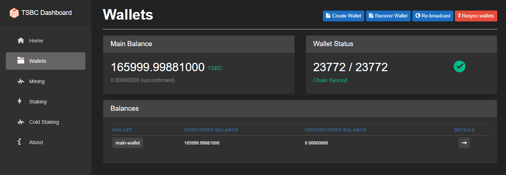
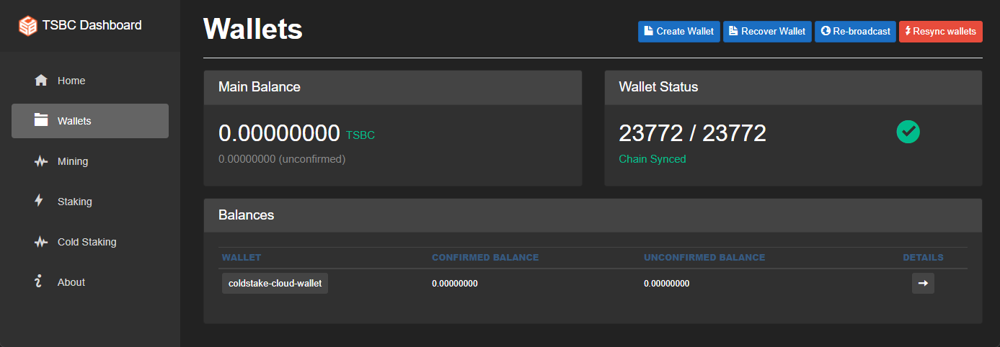
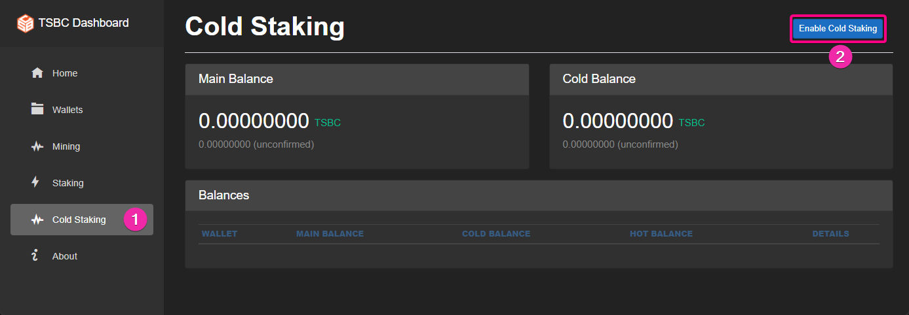
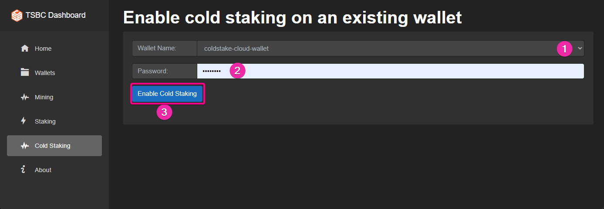
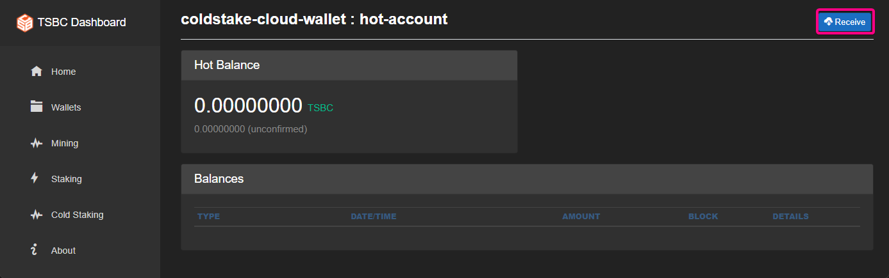
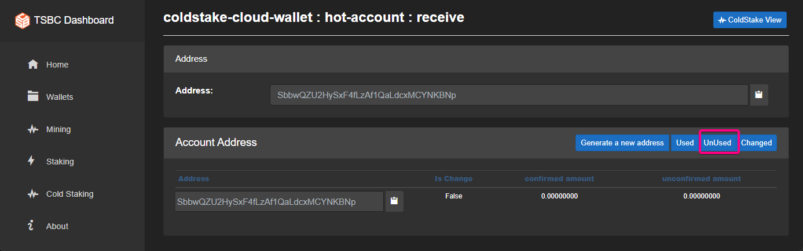
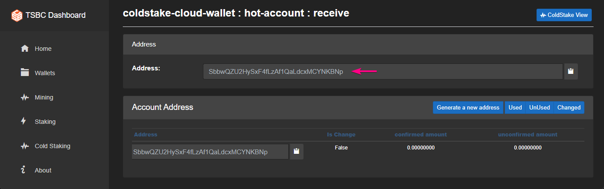
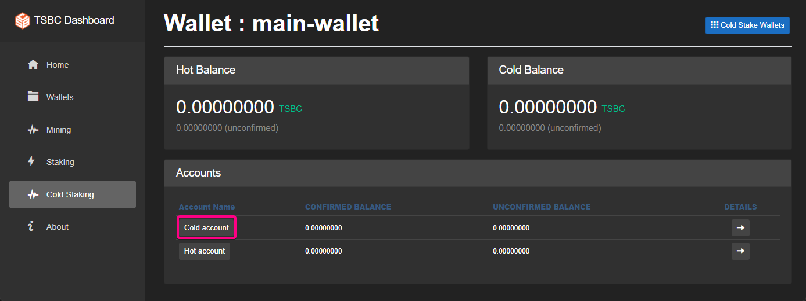
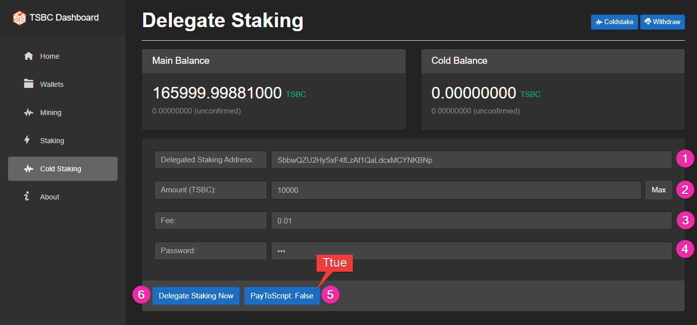
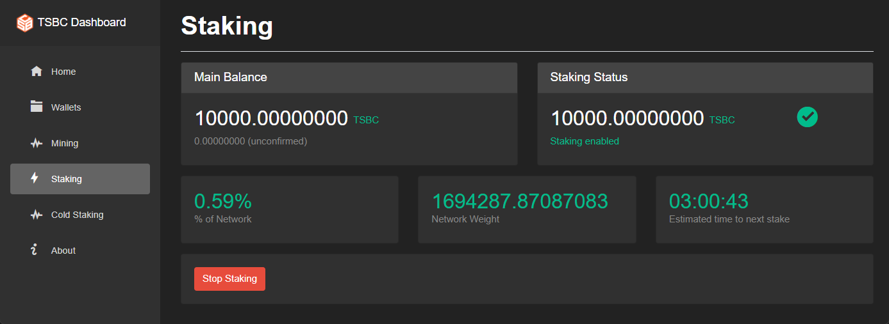

# Coldstake - Cloud Or pool

In this guide we will show how to run when the wallets are not on the same node  
This is useful for Coldstaking when the user runs a node in the cloud or wants to use coldstake pool  

### Getting started

Lets assume we have a node with a regular wallet named `main-wallet` that has the funds to be cold staked.

### 1 - Create a new wallet and call it coldstake-cloud-wallet

***Skip this section if you want to use a staking pool***  

### 2 - Go to the Coldstake tab and enable both wallets on each node for coldstaking.

***For pool staking do this step only for the the main-wallet*** 

Do the same for both wallet

This will create additional HD accounts that will be used for coldstaking  
Now when we go to the Coldstaking tab we will see this view.  

`coldstake-cloud-wallet`

`main-wallet`

Both wallets are now setup for coldstaking and we only have funds in the main-wallet  

### 3 - Get a hot address to stake on

***Skip this section if you want to use a staking pool, the pool will provide you with the hot address***

Get an address from the `coldstake-cloud-wallet`

On the cloud node go to the Coldstaking tab and click on the `coldstake-cloud-wallet`

Then select the Hot account

And click on Receive and then on the unused addresses

Copy the address from the text box or generate one if needed

This will be your staking address  

### 4 - Next we send coins to a coldstaking transaction

Go to the Coldstaking tab on the `main-wallet` node and select the `cold account`

There are two options to choose from, **Coldstake** and **Delegate**, they are very similar but with one difference,   
Coldstake will look in the local wallets to find addresses to send and receive from.

Use **Coldstake** - when both wallets are on the same node  
Use **Delegate** - when the staking wallet is on a different node (mostly used for staking pools or cloud staking)  

### 5 - Setup Coldstaking

Click on the **Delegate** button to continue.  
Next we send coins from the `main-wallet` to the `coldstake-cloud-wallet` (or to the pool address if using a coldstake pool) with a special coldstaking transaction   

Put the address we fetched earlier from the `coldstake-cloud-wallet` node or from the pool operator     
Select the amount you want to coldstake  
Set the fee it will cost to broadcast the transaction    
Decide if you want the output type to be PayToScript or not.  

Click on setup Delegate Staking Now, you will see a new entry in the history 

### 6 - Start staking

On the cloud node go to the Staking tab select the `coldstake-cloud-wallet` and start staking  

It should look like this

### 7 - Withdraw from coldstaking

Got to the Coldstaking tab and select the `main-wallet` (you cannot withdraw form the `coldstake-cloud-wallet`, that can be used only for staking)   
Select the `cold account`, and then click on withdraw button   
Click on the `main-wallet` to get a new address to withdraw to  
Select the amount to withdraw  
Click withdraw  

And then fill out the form

Now we should see this view in the Coldstaking tab  

