# Coldstake - Setup A Pool

In this guide we will show how to setup a coldstake pool  


**Charging fees**  
Right now there is no automated mechanism to charge fees from users for using the pool, each pool operator will have to find a way to charge for providing the service of staking for the user.
Either by paying in advance for a year of staking or any other way of subsidising the pool  

**Security concerns**  
Staking pools tend to centralize the mining processes by delegating authority to create blocks to a smaller number of users  
For this reason it is encouraged that a network will have many staking pools to choose from with competitive fees  

### 1 - Run a node in coldstake pool mode  

To setup a pool we have to run a fullnode on the network we want to provide coldstake pool services     
 
This is done by running a fullnode with the additional parameter `-enforceStakingFlag=1`  
When the `enforceStakingFlag` flag is set an additional menu will appear on the nodes dashboard  

The `enforceStakingFlag` will only allow only certain addresses to stake  
To allow an address to stake the pool operator needs to set that in the dashboard  

Here is an example of the entire command   
```
dotnet run --chain=CITY -enforceStakingFlag=1
```  

### 2 - Create the pool wallet

Create a wallet and call it `coldstake-pool` 

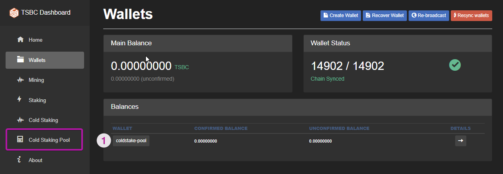

Notice the additional coldstake pool menu on the left   

Enable coldstaking on the `coldstake-pool` wallet

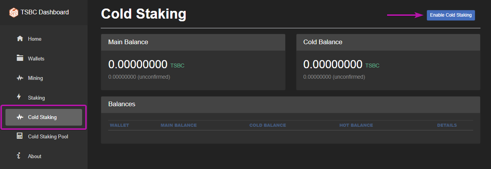

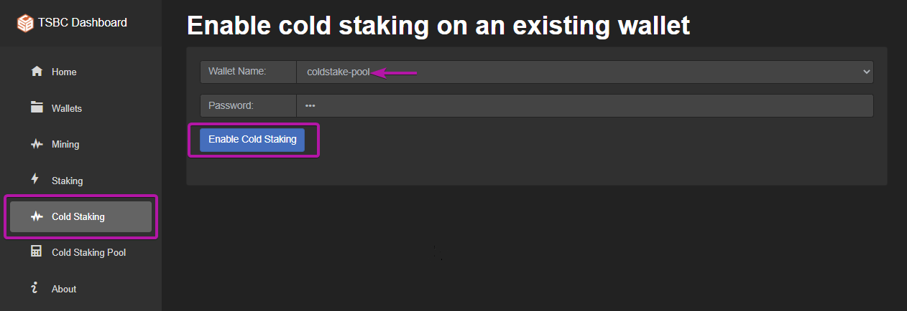

You should now see the `coldstake-pool` in the coldstake menu  

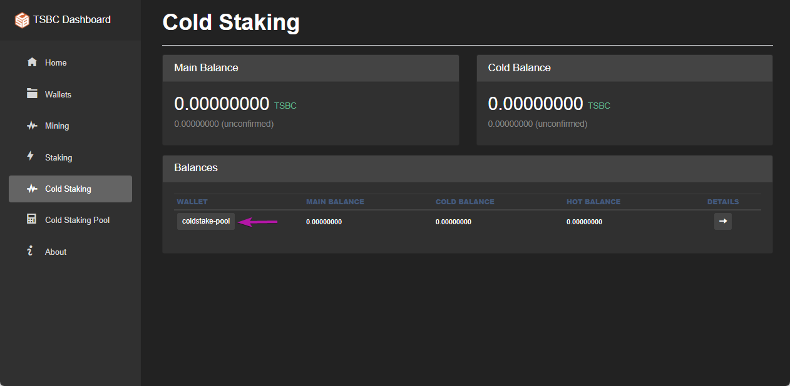

### 3 - Find your pool coldstake address

The pool can assign a new address for each user or have a single address that all users can just use to setup coldstaking  

For ease of use we recommend using just one address to represent the pool, then such an address can be displayed on a static website and users won't need the extra step of asking the pool operator for a new address   

All the addresses that the pool uses are hot addresses  

Go on the *Cold Staking* menu and click on the `coldstake-pool`  then click on the Hot account  

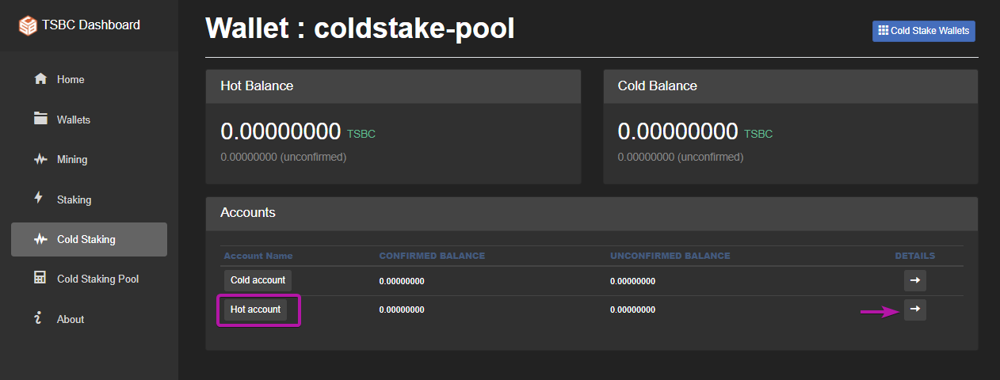

Then click on Receive  

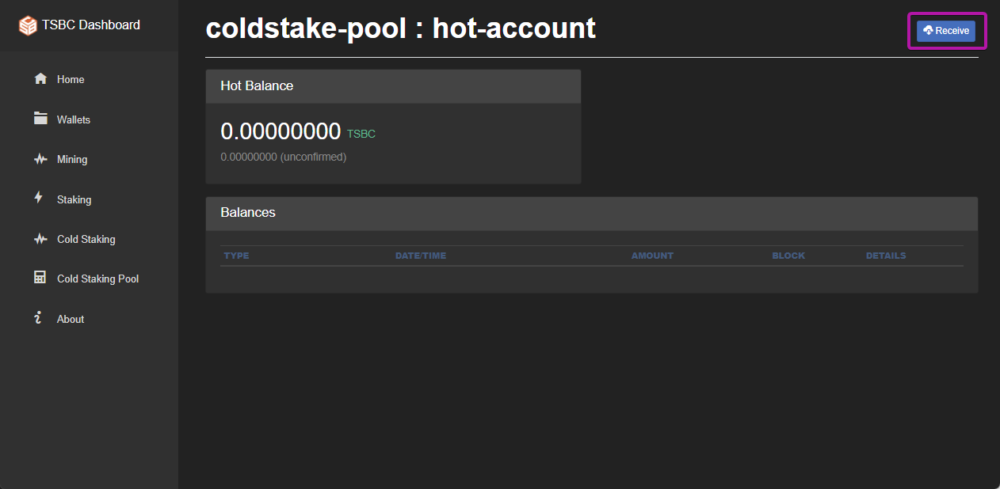

Then click on UnUsed, this is your coldstake hot address

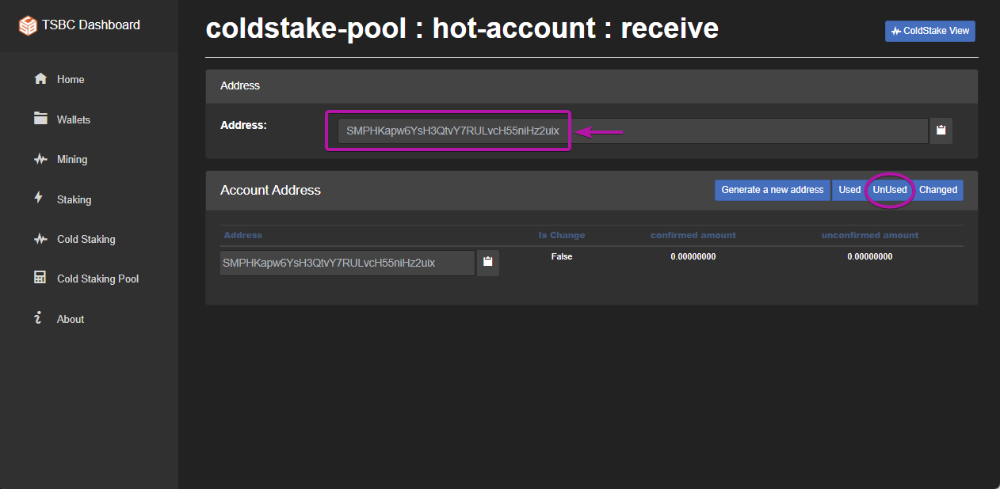

If you want to assign a new address per user just click on *generate a new address*   
Note a new address will be automatically generated when the previous address has coins in it  

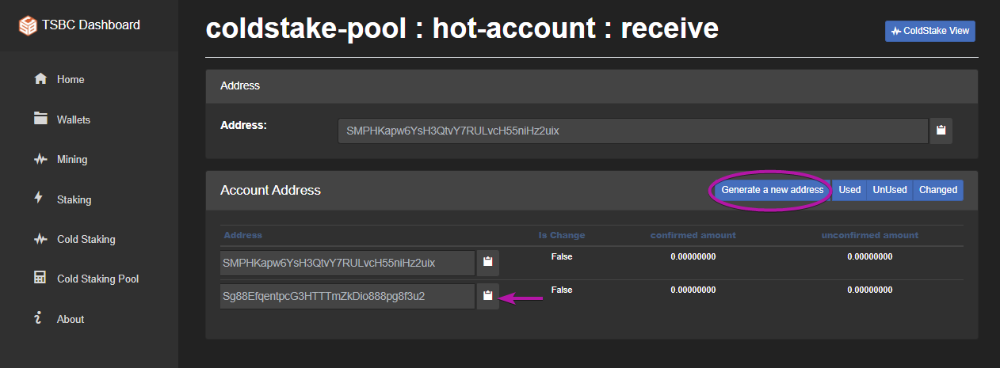  

**Security note**
```
A possible attack on a staking pool node is to send many small dust trx to it,  
this is even worse if the hot address is public and known     
however the node will normally ignore dust transactions when staking  
```
### 4 - Users will now setup coldstake transactions

When users start to setup their wallet to coldstake with your pool it will look like this  

Go on the *Cold Stake* menu and click on `coldstake-pool` wallet details 

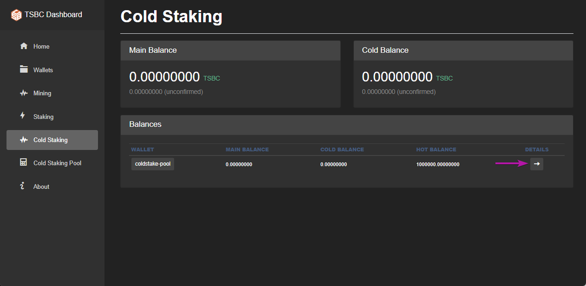  

Select the Hot account

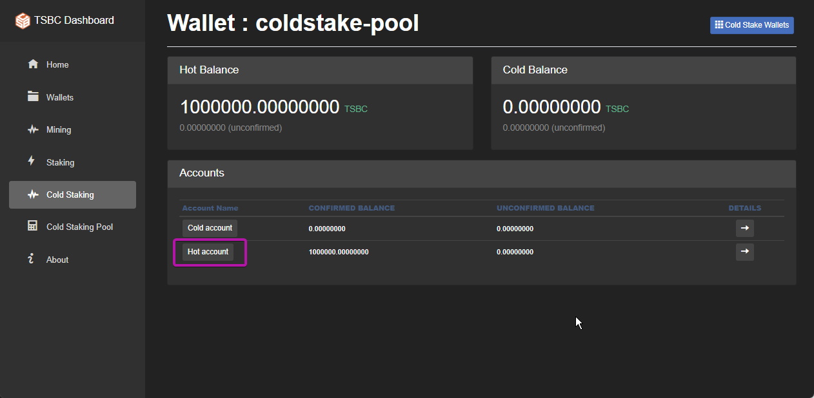  

Notice the hot account history  
Here you will also see all the staked coins  

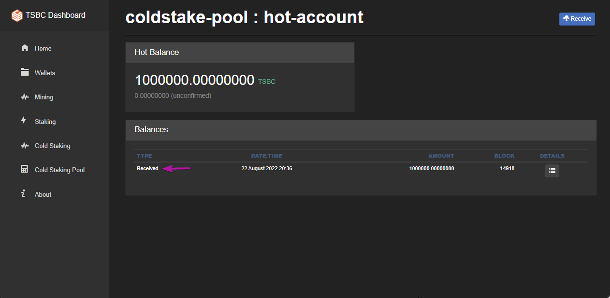  

### 3 - Enabling addresses to coldstake  

Each address that is used for staking needs to be explicitly enabled  

Got to the *Cold Staking Pool* dashboard menu to observe the addresses that can coldstake  

Click on the `coldstake-pool` wallet  

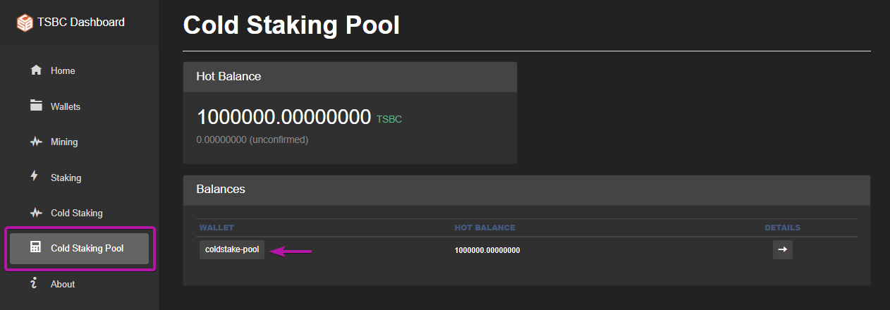  

You will notice the hot address of the pool and the cold address the user controls 

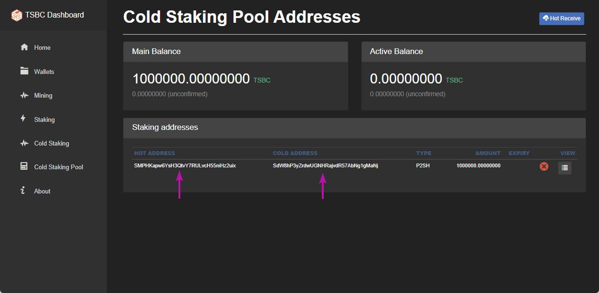  

Here is an exmaple with another user that sent coins to the pool  

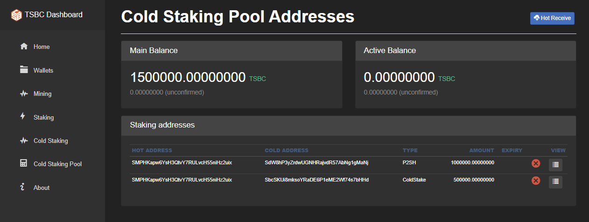 

If you click on the *view* button you will get more details about the address  

 

**Days to expiry**  
On each address you can specify the number of days it can stake until that address expires  
An address that expired will not participate in the pools staking process    

It will then look like this on the address list    

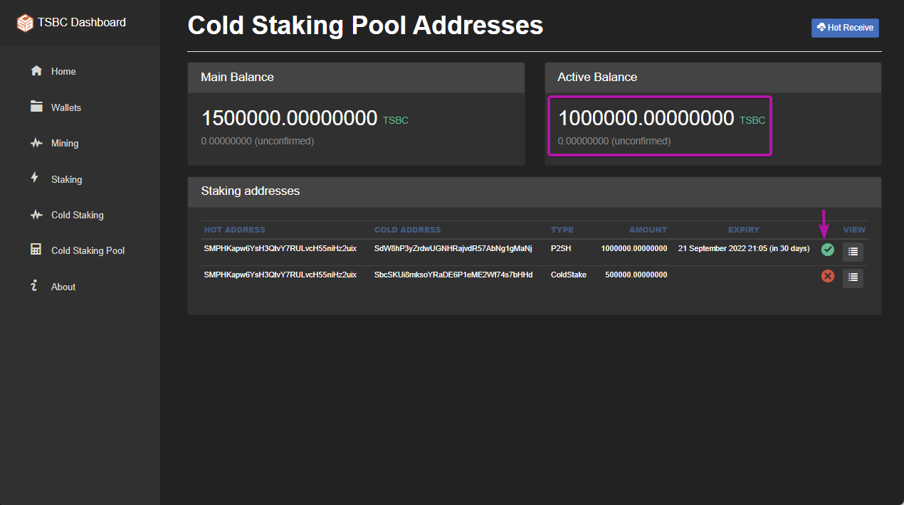 

Notice the active balance will show the amount of coins that are not expired  

### 4 - Starting the staking job  

To start the pool to stake go to the *Staking* menu  

Click on the `coldstake-pool` wallet and then click on *Start Staking* 

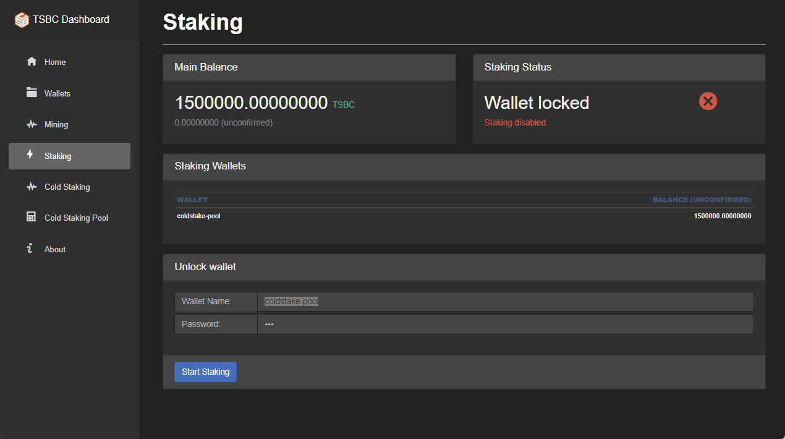 

It will then look similar to this

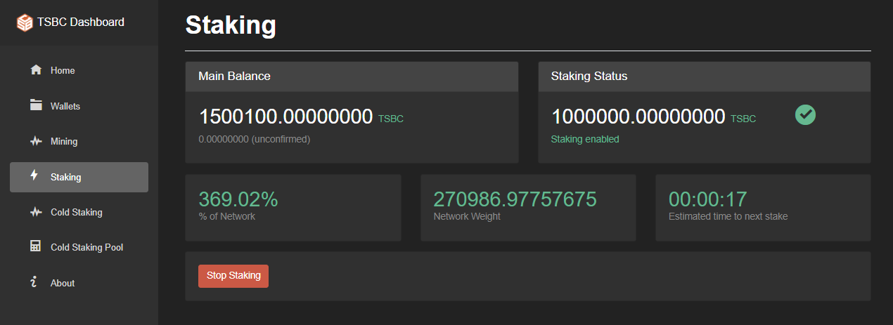 

Once the node will start staking you will see entries in the Hot account history  
Go to *Cold Staking* -> `coldstake-pool` -> Hot account 

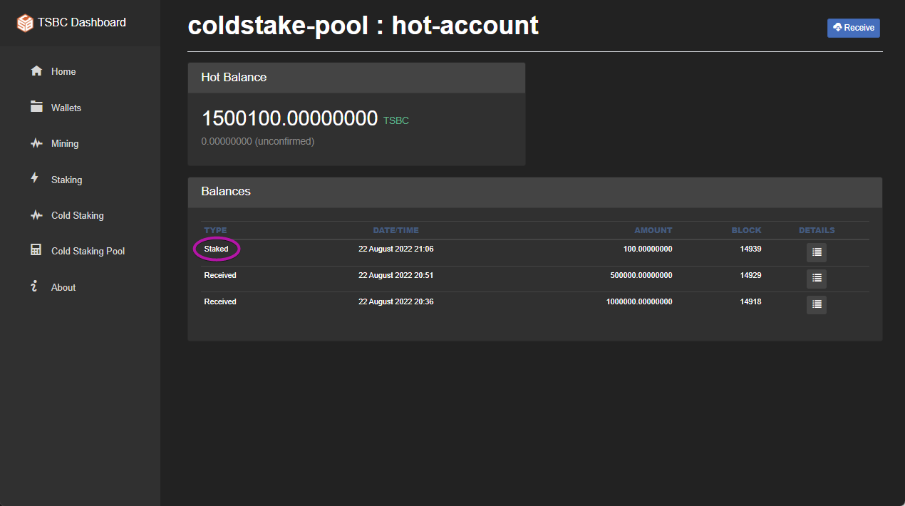 

