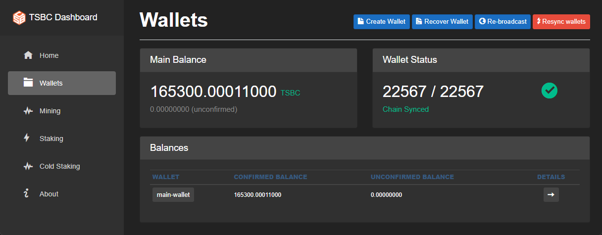
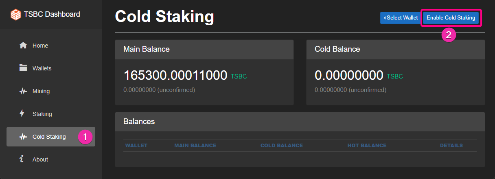
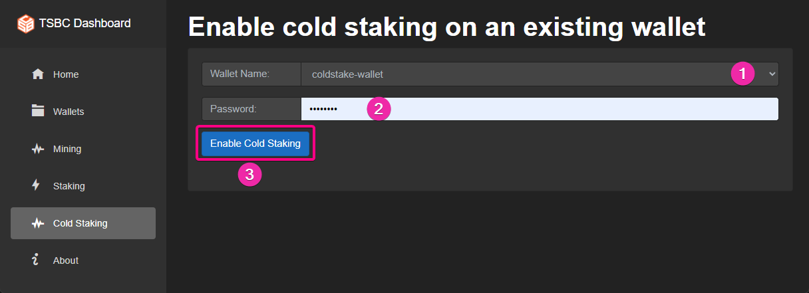
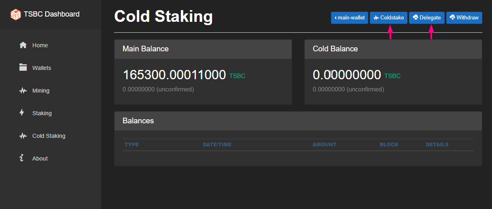
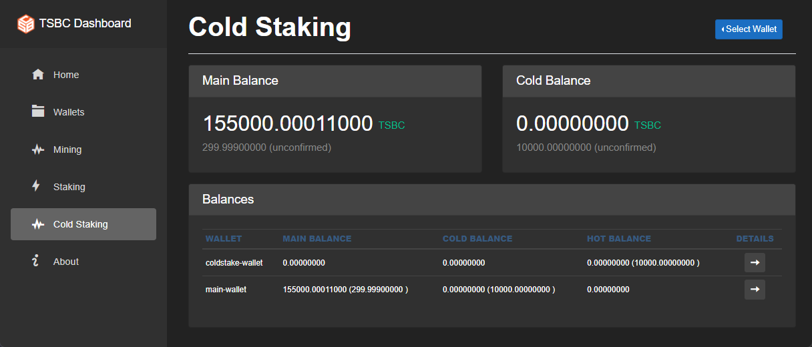
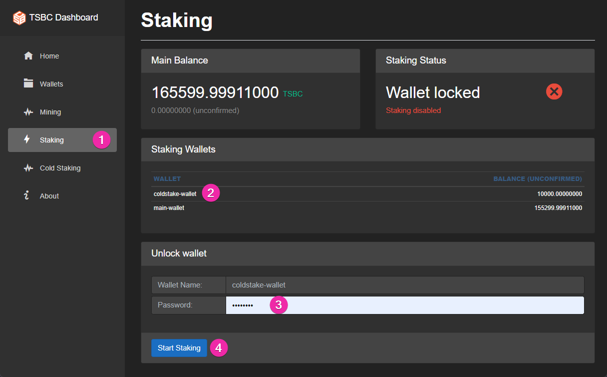
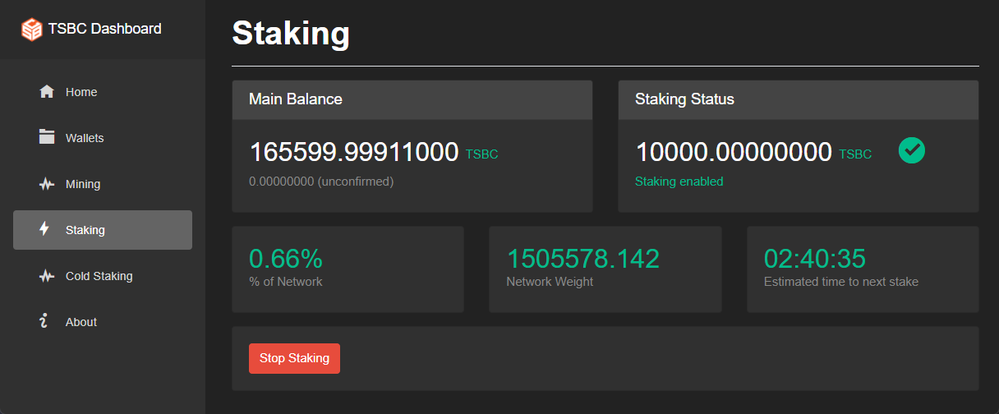
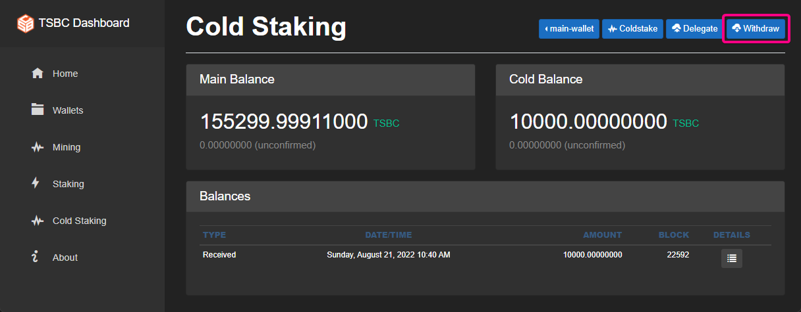
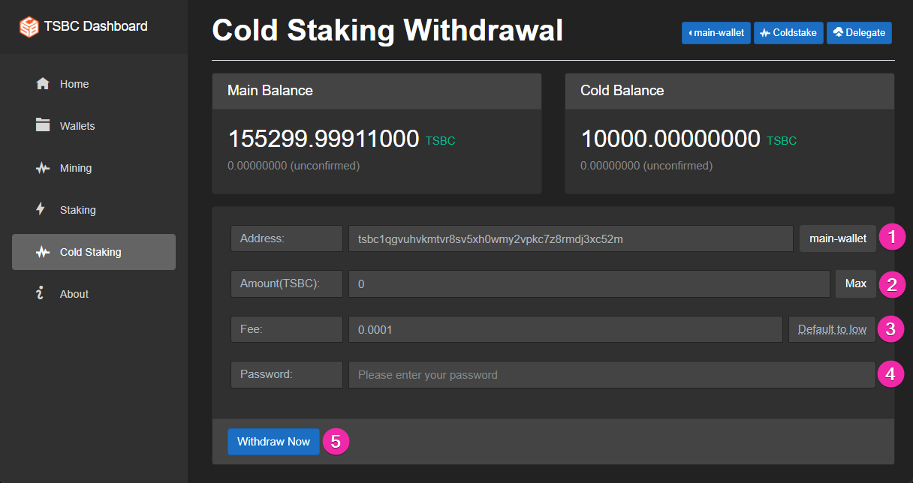
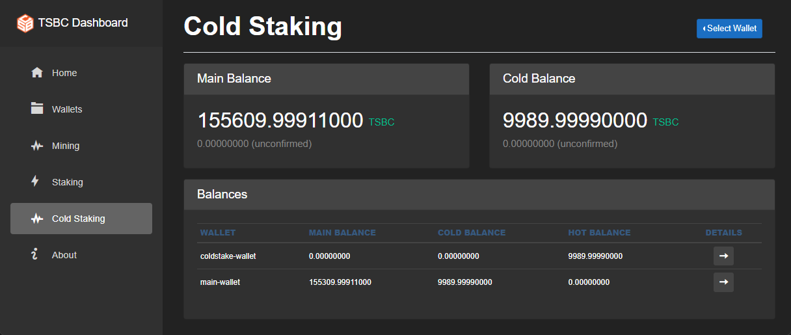

# Coldstake At home

In this guide we will show how to run a cold staking setup where both wallets are on the same node  
This is for miners that want to Coldstaking at home and get the benefits of the enhanced security

### Getting started

Lets assume we have a node with a regular wallet named `main-wallet` that has the funds to be cold staked.

### 1 - Create a new wallet and call it coldstake-wallet

### 2 - Go to the ColdStaking tab and enable both wallets for coldstaking.

Do the same for both wallet

This will create the additional HD accounts that will be used for coldstaking  
Now when we go to the Cold Staking tab we will see this view.  

Both wallets are now setup for coldstaking but we only have funds in the main-wallet    

### 3 - Next we send coins to a coldstaking transaction

Go to the main-wallet and select the `cold account`

There are two options to choose from, **Coldstake** and **Delegate**, they are very similar but with one difference,   
Coldstake will look in the local wallets to find addresses to send and receive from.

Use **Coldstake** - when both wallets are on the same node  
Use **Delegate** - when the staking wallet is on a different node (mostly used for staking pools or cloud staking)  

### 4 - Setup Cold Staking

Click on the **Coldstake** button to continue.  
Next we send coins from the main wallet to the `coldstaking-wallet` with a special coldstaking transaction   

Click on the coldstake-wallet to get a new address  
Select the amount you want to coldstake  
Select a fee  
Decide if you want the output type to be PayToScript or not.  

Click on setup coldstaking, you will see a new entry in the history  

And if you go to the Cold Staking tab you will now see hot balance in the `coldstake-wallet` and and cold balance in the `main-wallet`  

### 5 - Start staking

Go to the Staking tab select the `coldstake-wallet` and start staking  

It should look like this

### 6 - Withdraw from coldstaking

Got to the Cold Staking tab and select the `main-wallet` (you cannot withdraw form the `coldstaking-wallet`, that can be used only for staking)   
Select the `cold account`, and then click on withdraw button   
Click on the `main-wallet` to get a new address to withdraw to  
Select the amount to withdraw  
Click withdraw  

Now we should see this view in the Cold Staking tab  

