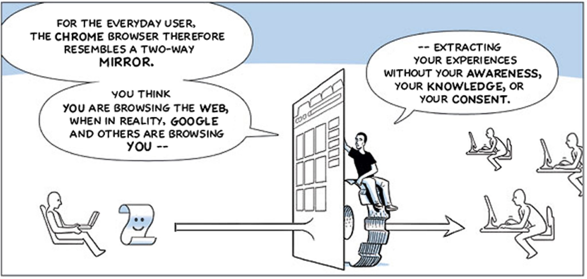

**What Does it Mean to be a Decentralized Social Media Platform?**

_Articulating first principles as a means to discover requirements towards a social media platform_

**A Decentralized Social Media Platform**

Sounds great, but what does it mean? Does the ability to spin up a server and provide a web U.I. constitute a &quot;decentralized&quot; server? In the original sense of the early internet, where any person could connect their computer to the internet, publish that machine&#39;s I.P. Address, and listen on port 80, then yes, in this sense, it is a genuinely decentralized _social media_ web application. That&#39;s fine. As far as it goes. Let&#39;s call it the SoapBox Platform idea. Every person with the technical know-how can set up their own soapbox. But what about the plebs, those without the expertise to do this?

In the first days of the internet, a person would set up a webserver to publish their _website_ and then _speak with that voice_ on the internet_._ There was a one-to-one mapping of speech to person (reminder: the U.S. Supreme Court ruled that a corporation is a person, and money is speech).

In ancient Athens, where democracy was invented, those who owned land could vote. Those who did not own land had no say. To extend the Athens analogy, let&#39;s say one person owns all the land, so there is only one vote that matters. This is a fair analogy to the Soapbox platform concept. The soapbox owners control the speech of that platform because they control who can speak, and therefore they control all the speech.

In a nutshell, countering this type of centralized control is the psychological driver behind the decentralization movement on the internet.

Over the last few years, **disposition, portability** , **functionality** , **data** , and **identity** have emerged as critical elements of decentralization.

Also, the productization of the user has become a reality on centralized social media platforms and other internet &quot;utilities&quot; such as search engines. This graphic tells the tale:

The ability to productize the user is a direct consequence of centralized control over all actions on the platform. The trade-off for the user is that they have &quot;free&quot; access. In exchange for the market analysis tracking the user&#39;s activities, the platform can direct advertisements to the user they will most likely find interesting. This produces the funding that **supports and sustains the platform** as a revenue model.

This mechanism seems somewhat innocuous on its face, but consider that it can be aimed at the sphere of political activity on social media. This is evidenced by Facebook&#39;s use of these algorithms in the 2016 U.S. Presidential Election to promote heated and adversarial political arguments on their platform to _socially engineer more clicks_ resulting in a deep political polarization in the U.S. This is where centralized control of speech becomes nasty. And it suggests that the productization of the user may not be the best means of funding for a decentralized social media platform. And yet some means of funding is necessary.

**Requirements**

So let&#39;s make a list of requirements a social media platform must have to be considered decentralized. We can then use this list to construct a scorecard to assess how decentralized a platform is.

**Disposition**

What and where is the server(s)? Are they behind a single Domain Name representing a single entity? If that is the case, then they are considered centralized.

1\. _Distributed servers_: the physical _disposition_ of the servers _must_ be distributed across a network so that they cannot be controlled by a single entity or &quot;oligarchy.&quot; This should ensure that owner(s) cannot shut down the soapbox.

**Functionality**

In a decentralized network of servers, how does the functionality get deployed over time? This is a tricky problem. Bitcoin, Ethereum, and other cryptocurrencies have varied strategies to upgrade server nodes over time. And Ethereum and other blockchains have introduced dApps, distributed applications, to expose new functionality on the network. A Decentralized Social Media Platform will face the same problems.

2\. _Functionality_: Application Logic _must_ be deployable and upgradable across the decentralized network.

**Data**

Concepts surrounding _data_ on a decentralized social media network are complex and multi-dimensional. Data could be meta-data (list of followers/friends/blocks), messages, posts, images, videos, etc. But one idea that is universally accepted in the decentralized (Self-Sovereign) community is that a person owns their data. This means that each person has complete control of their data. But there is more to think about concerning Data on a decentralized network. Such as storage which, again, is another complicated topic. And, once users put data on that server, can they be locked out or banned from that server? If so, this is also a consequence of centralization because users cannot take their data (which might include a list of their friends/followers) and move it to another platform. In other words, the data is not portable.

For now, we can articulate these requirements:

3\. _Data Ownership_: Each platform user must have complete control of their data.

4\. _Data Storage_: must be stored and retrieved from a distributed decentralized network of storage containers.

5\. _Portability_: the user must have the means to take their data and move to another soapbox.

**Identity**

So we have a requirement for complete ownership of a user&#39;s data by _that user_. But who is _that_ user? To ensure ownership of an artifact, we must have a way to verify and validate a user&#39;s claims of identity. Identity is a central theme around the concept of _access_, also. This is because _access_ is necessary for speech on a given platform. How can we handle identity in a decentralized way that does not rely on a centralized entity? Access is also tied to the idea of ownership and control. When users are asked to show their identity, can they show artifacts proving identity that do not require mediation through a centralized authority? In other words, can a person prove who they are without relying on a 3rd party to say who they are? What if that 3rd Party is compromised somehow or disappears altogether? On a decentralized social media platform, identity is a crucial concept that underpins all human interactions on a decentralized platform.

These are hot topics in the Self-Sovereign community, but we can state this requirement for now.

6\. _Identity_: A user must have complete control over and access to the mechanism that proves their claims of who they are.

**Support and Sustainment**

The revenue model of today&#39;s leading social media platforms, productization of the user, as means for support and sustainment of the platform is not in the best interest of the platform&#39;s users. But it costs money to support any kind of computer network. So what other means of support might be devised in a decentralized way? We don&#39;t need to look far for a solution. This is what crypto-currencies do, provide a means of support for their underlying blockchain network. Details matter here. Types of crypto-currencies are delineated by their consensus algorithms. Two well-known consensus algorithms are Proof of Work and Proof of Stake. We won&#39;t get into the details of that rabbit hole just yet, except to say that the more aligned the consensus algorithm is to the platform&#39;s mission, the greater the chance of success. For now, let&#39;s state the requirement.

7\. _Support and Sustainment_: The platform must provide a built-in, decentralized means of sustainment through a crypto-currency mechanism that aligns with and supports the platform&#39;s mission.
