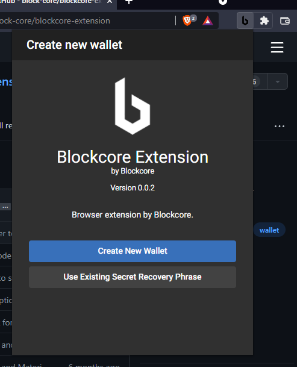

# Extension: Installation

## Edge Add-on Store

Availability later 2022

[https://microsoftedge.microsoft.com/addons/Microsoft-Edge-Extensions-Home](https://microsoftedge.microsoft.com/addons/Microsoft-Edge-Extensions-Home)

## Chrome Web Store

Availability later 2022

[https://chrome.google.com/webstore/category/extensions](https://chrome.google.com/webstore/category/extensions)

## GitHub

Follow these instructions to manually install the extension. This allows you to test early releases and updates to the extension. These early releases
can potentially have bugs, [issues](https://github.com/block-core/blockcore-extension/issues) (report by clicking link) and problems.

1. Download the extension package from [releases](https://github.com/block-core/blockcore-extension/releases).   
Download the `blockcore-*.zip` file to your local computer.

2. Unpack the .zip file to a folder anywhere on your computer.

3. Use a Chromium-based browser, like Brave, Edge, Chrome and others that supports extensions.

Either find the extension page through the menu, or open this URL:

[edge://extensions/](edge://extensions/)   
[chrome://extensions/](chrome://extensions/)   
[brave://extensions/](brave://extensions/)   

From the extension page in your browser, find the "Developer mode" toggle and turn it on.

After developer mode has been turned on, new options appear. Click the `Load unpacked`.

Locate the folder where you have unpacked the .zip file you downloaded earlier.

The extension is now installed.

When the extension is first installed, it will open up a new tab with the extension in full view model.

You can pin the extension to the toolbar on your browser.

Then you can easily access it through clicking the icon on the toolbar.

Congratulations, you have successfully installed the extension and can continue by creating your new wallet.
