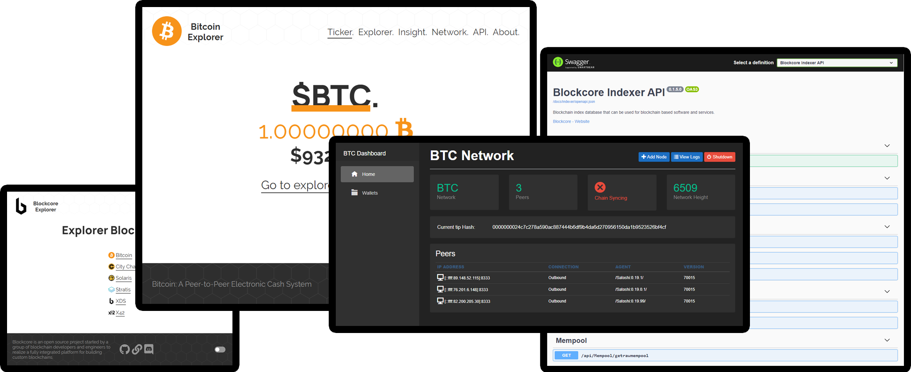

--8<-- "refs.txt"

# Blockcore is a platform that enables you to build your own blockchains.

Blockcore is the foundation for realizing blockchains and includes core functionality to create your own custom blockchain with a lot of tooling supporting your blockchain.

The tooling as part of the Blockcore platform includes; Block Explorer, Block Indexing, Block Analytics, Wallets, API Wallet Service, Developer Tooling, Documentation and more.

Blockcore is under continuous development to stay at the cutting edge of Bitcoin and blockchain technology. We invite you to engage with our community.

## Features

* Blockcore is a platform to build Layer 1 consensus networks based on the Bitcoin protocol
* Compatible with Bitcoin, and other chains built on Blockcore.
* Built on the .NET Core framework and written entirely in C#.
* SegWith supported
* APIs and SDKs for app developers
* Ecosystems of software, including block explorer, indexers, wallet software and more.

## Create your own blockchain

One of our goals is to make it super easy for you to start developing your own blockchain. Watch this video on how you can quickly get started:

### Who is responsible

Blockcore is code, not a company. It's a gathering of individuals who contribute voluntarily to open source software development.

### Contributing

Pull requests are welcome and appreciated.

If you'd like to support the project, please visit the [sponsors page](https://www.blockcore.net/sponsors).

## Call to Action!

!!! tip "Join to give feedback, ask for features, support, etc."
	Discord server: [https://www.blockcore.net/discord](https://www.blockcore.net/discord){:target="_blank"}  

## CI

| Current status                                               |
| ------------------------------------------------------------ |
| {:target="_blank"} |
