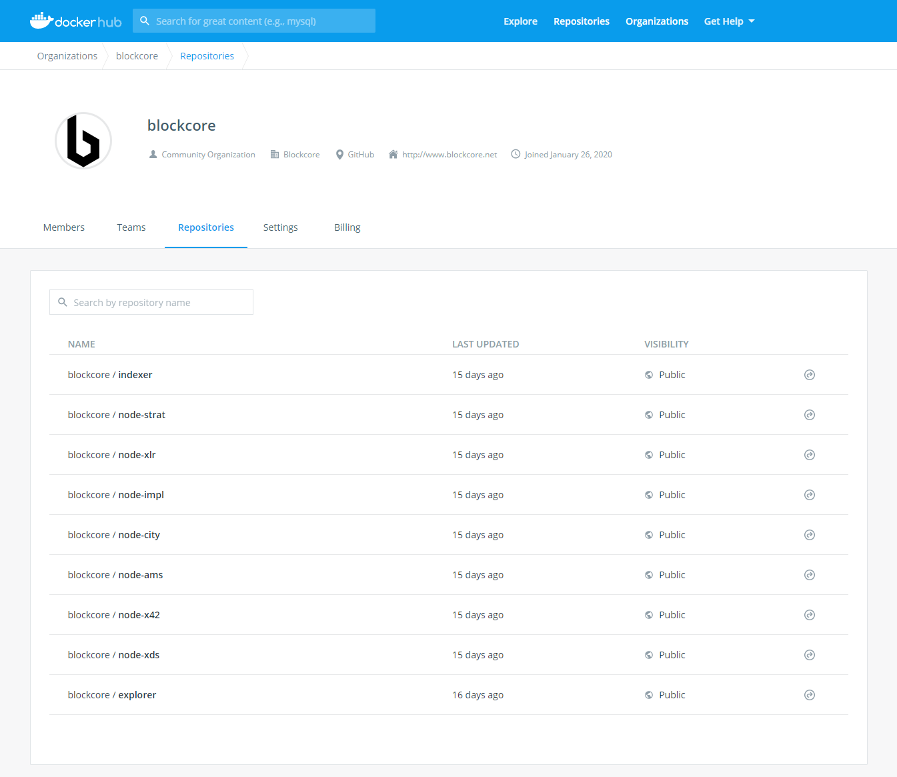

--8<-- "refs.txt"

While individual blockchains that build on the Blockcore Platform will have their own official node and wallet software, we also provide a set of reference nodes.

*This software is provided without any support, use at your own risk.*

Blockcore is available for the below listed blockchains.

### Bitcoin
- [chains/BTC.json](https://chains.blockcore.net/chains/BTC.json)
- [docker/BTC/explorer.yml](https://chains.blockcore.net/docker/BTC/explorer.yml)
- [docker/BTC/indexer.yml](https://chains.blockcore.net/docker/BTC/indexer.yml)

### City Chain
- [chains/CITY.json](https://chains.blockcore.net/chains/CITY.json)
- [docker/CITY/docker-compose.yml](https://chains.blockcore.net/#:~:text=docker/CITY/docker-compose.yml)

### SERF
- [chains/SERF.json](https://chains.blockcore.net/chains/SERF.json)
- [docker/SERF/docker-compose.yml](https://chains.blockcore.net/docker/SERF/docker-compose.yml)

### Impleum
- [chains/IMPLX.json](https://chains.blockcore.net/chains/IMPLX.json)
- [docker/IMPLX/docker-compose.yml](https://chains.blockcore.net/docker/IMPLX/docker-compose.yml)

### OpenExO
- [chains/EXOS.json](https://chains.blockcore.net/chains/EXOS.json)
- [docker/EXOS/docker-compose.yml](https://chains.blockcore.net/docker/EXOS/docker-compose.yml)

### Rutanio
- [chains/RUTA.json](https://chains.blockcore.net/chains/RUTA.json)
- [docker/RUTA/docker-compose.yml](https://chains.blockcore.net/docker/RUTA/docker-compose.yml)

### Solaris
- [chains/XLR.json](https://chains.blockcore.net/chains/XLR.json)
- [docker/XLR/explorer.yml](https://chains.blockcore.net/docker/XLR/explorer.yml)
- [docker/XLR/indexer.yml](https://chains.blockcore.net/docker/XLR/indexer.yml)

### Stratis
- [chains/STRAX.json](https://chains.blockcore.net/chains/STRAX.json)
- [docker/STRAX/docker-compose.yml](https://chains.blockcore.net/docker/STRAX/docker-compose.yml)

### x42
- [chains/X42.json](https://chains.blockcore.net/chains/X42.json)
- [docker/X42/docker-compose.yml](https://chains.blockcore.net/docker/X42/docker-compose.yml)

### XDS
- [chains/XDS.json](https://chains.blockcore.net/chains/XDS.json)
- [docker/XDS/docker-compose.yml](https://chains.blockcore.net/docker/XDS/docker-compose.yml)

### X1
- [chains/X1.json](https://chains.blockcore.net/chains/X1.json)
- [docker/X1/docker-compose.yml](https://chains.blockcore.net/docker/X1/docker-compose.yml)

### XRC
- [chains/XRC.json](https://chains.blockcore.net/chains/XRC.json)
- [docker/XRC/docker-compose.yml](https://chains.blockcore.net/docker/XRC/docker-compose.yml)

### HOMECOIN
- [chains/HOME.json](https://chains.blockcore.net/chains/HOME.json)
- [docker/HOME/docker-compose.yml](https://chains.blockcore.net/docker/HOME/docker-compose.yml)


## Download

Go to the [releases](https://github.com/block-core/blockcore-nodes/releases) page to find the packaged nodes for various chains. Separate downloads for Windows, Linux and macOS is available.

## Docker

All our Blockcore Reference Nodes is published to our [Docker Hub](https://hub.docker.com/orgs/blockcore/repositories).



It is super easy to spin up a new instance of any of the nodes, they all follow the same syntax (name and version).

*We advice on using specific version when using docker, like our example below.*

Run the Blockcore Reference Node for XDS blockchain in interactive mode:

```sh
docker run blockcore/node-xds:1.0.4
```

To spin up a docker container instance in the background, apply the "-d" tag.

Run the Blockcore Reference Node for City Chain blockchain in background:

```sh
docker run blockcore/node-city:1.0.4
```

## Support and compatibility

These are all unofficial node software. They are not supported in any way.

The software can be incompatible with the blockchain they are built for.

You run the risk of getting your IP address banned on the blockchain if you run
node software that violated the blockchain consensus.

Please refer to the official software for individual blockchains for supported node software.
